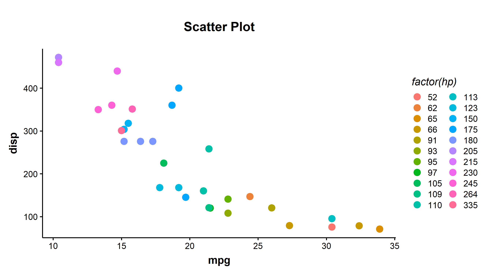
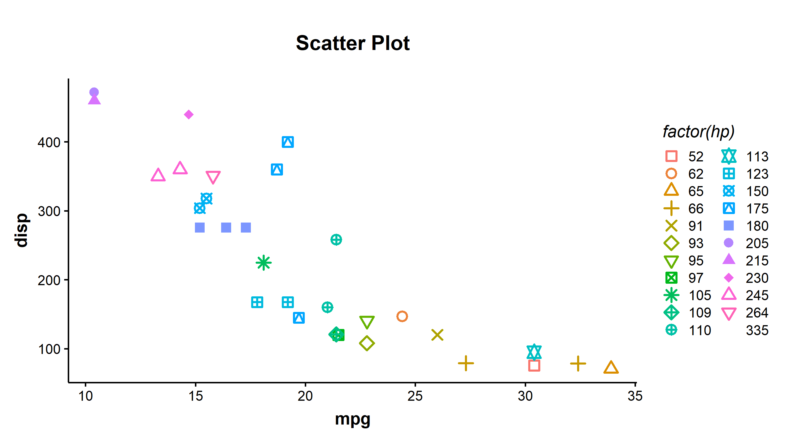
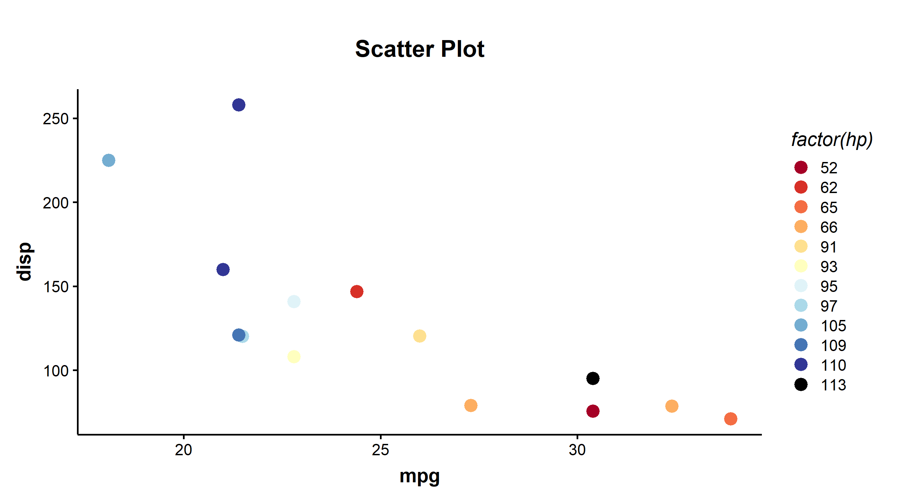
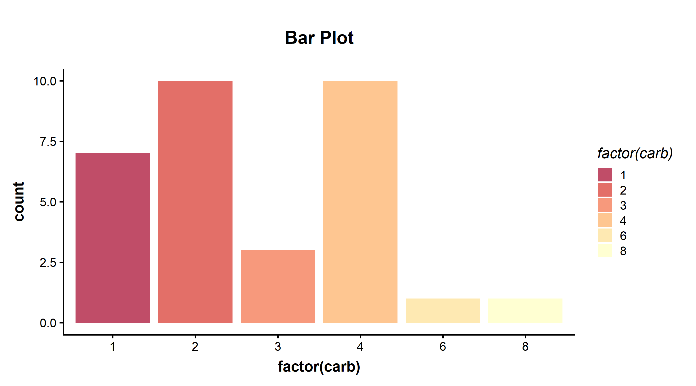

# ggplot_publication_themes
 R files for custom ggplot themes. These themes are modified from https://github.com/koundy/ggplot_theme_Publication

Themes are in https://github.com/karenbobier/ggplot_publication_themes/blob/main/ggplot_themes_for_publications.R 

Example code use in https://github.com/karenbobier/ggplot_publication_themes/blob/main/test_themes.R and plots in https://github.com/karenbobier/ggplot_publication_themes/tree/main/plots


# Examples
```r
#load packages
library(tidyverse)
library(ggthemes)
# get theme file
#if you want to download just the theme file and not the repository
#download.file(url="https://raw.githubusercontent.com/karenbobier/ggplot_publication_themes/refs/heads/main/ggplot_themes_for_publications.R", destfile="ggplot_themes_for_publications.R")
source('ggplot_themes_for_publications.R')
```

Create a scatter plot with theme_Publication
```r
Scatter <- ggplot(mtcars, aes(mpg,disp,color=factor(hp))) + geom_point(size=3, stroke=1.2) + labs(title="Scatter Plot")
Scatter + theme_Publication()
```

<!-- -->

Add point shapes
```r
Scatter_shapes <- ggplot(mtcars, aes(mpg,disp,color=factor(hp), shape=factor(hp))) + geom_point(size=3, stroke=1.2) + labs(title="Scatter Plot")
Scatter_shapes + theme_Publication() + scale_shape_custom()
```

<!-- -->

I also added a colorblind friendly pallet with 11 colors. Based on an color brewer pallet plus black

```r
Scatter_subset <- ggplot(mtcars_subset, aes(mpg,disp,color=factor(hp))) + geom_point(size=3, stroke=1.2) + labs(title="Scatter Plot")
Scatter_subset + theme_Publication() + scale_colour_colorblind()
```

<!-- -->

Here is an example barplot with this theme and the colorblind friendly pallet
```r
Bar <- ggplot(mtcars, aes(factor(carb),fill=factor(carb))) + 
  geom_bar(alpha=0.7) + 
  labs(title="Bar Plot") +theme_Publication()
Bar + scale_fill_colorblind()
```

<!-- -->

